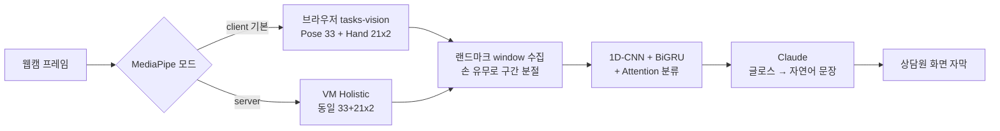
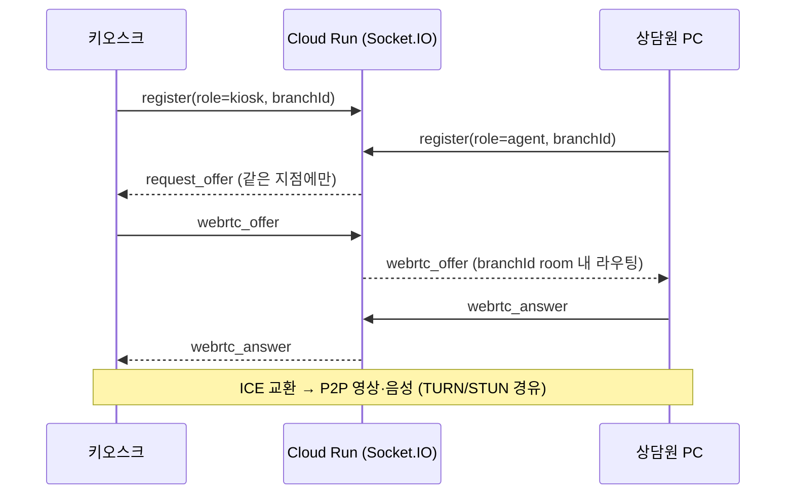

# 🌷 피어나 (Pierna)

> **농인의 목소리가 민원 현장에서 다시 피어나도록**
> 주민센터 창구용 AI 양방향 수어 통역 보조 서비스

<p align="center">
  
  
  
  
  
  
  
  
  
</p>

---

## 목차
1. [소개](#-소개)
2. [배경](#-배경)
3. [핵심 기능](#-핵심-기능)
4. [시스템 아키텍처](#️-시스템-아키텍처)
5. [핵심 파이프라인](#-핵심-파이프라인)
6. [지점별 분리 (멀티테넌시)](#-지점별-분리-멀티테넌시)
7. [배포 · CI/CD](#-배포--cicd)
8. [기술 스택](#️-기술-스택)
9. [모델 성능](#-모델-성능)
10. [개인정보 보호](#-개인정보-보호)
11. [프로젝트 구조](#-프로젝트-구조)
12. [실행 방법](#️-실행-방법)
13. [팀 · 데이터](#-팀-오동가영)

---

## 📖 소개

**피어나(Pierna)** 는 주민센터 창구에서 AI가 **수어와 음성을 실시간으로 상호 통역**하여, 농인이 통역사 동행 없이 직접 민원을 처리할 수 있도록 지원하는 서비스입니다.

농인이 수어로 요청을 전달하면 자연어 문장으로 변환해 직원에게 보여주고, 직원의 음성은 STT를 통해 자막으로 농인에게 전달됩니다. 공무원은 기존 업무 절차를 그대로 수행하고 **AI는 의사소통 통역만 전담**하는 구조로, 공공기관 도입 부담을 최소화했습니다.

> 💬 *"복지카드를 잃어버렸습니다. 재발급 받고 싶습니다."*
> 창구에서 몇 분이면 끝나는 민원이, 수어를 쓰는 농인에게는 통역사 없이는 어렵습니다. 피어나는 그 벽을 허뭅니다.

### 설계 취지
- **즉시성** — 예약·대기 없이 창구에 비치된 태블릿으로 바로 대면 상담
- **비침습성** — 공무원의 업무 흐름을 바꾸지 않음. AI는 통역만, 행정 처리·의사결정은 사람이
- **프라이버시 우선** — 개인정보 최소 수집 + 마스킹 + 암호화 + 보존기간 자동 삭제 (개인정보보호법 대응)
- **지점 독립 운영** — 중앙 서버에 민감정보를 모으지 않고, 각 동사무소가 **자기 로컬 DB로 독립 운영**

---

## 🎯 배경

| 지표 | 수치 | 출처 |
|------|------|------|
| 전국 등록 청각장애인 | 약 **44만 명** | 보건복지부, 2024 |
| 수어 주 사용 농인 | 약 **13만 명** | 국립국어원, 2023 |
| 공공기관 이용 시 수어통역 필요 응답 | **62.9%** | 국립국어원, 2023 |
| 한국수어를 농인의 언어로 인식 | **90.8%** | 국립국어원, 2023 |

현행 지원 체계(손말이음센터·출장 통역)는 예약·대기·비용 부담으로 **즉시 대응이 어렵습니다.** 피어나는 창구에 상시 비치된 태블릿으로 **별도 절차 없이 즉시** 대면 상담을 지원합니다.

---

## ✨ 핵심 기능

| | 기능 | 설명 |
|---|---|---|
| 1️⃣ | **수어 → 자연어** | 카메라로 수어를 인식 → AIHub 한국 수어 데이터셋 기반 분류 → Claude로 자연스러운 한국어 문장 변환 |
| 2️⃣ | **음성 → 자막** | 직원 음성을 Web Speech STT로 실시간 자막화 → 농인 화면에 표시 |
| 3️⃣ | **실시간 영상 상담** | 키오스크↔상담원 PC 간 WebRTC P2P 영상·채팅 (원격 수어통역사 연결 가능) |
| 4️⃣ | **대기 중 복지 안내** | 공공데이터 복지서비스 API 연동 → 청각장애인 맞춤 복지 정보 카드 |
| 5️⃣ | **상담 종료 처리** | Claude 상담 요약 → 카카오톡 전송 + 개인정보 암호화 저장 |
| 6️⃣ | **지점별 독립 운영** | 동사무소마다 자기 계정·로컬 DB로 분리, 지점 간 데이터·연결 완전 격리 |

---

## 🏗️ 시스템 아키텍처

> **"지점별 로컬 운영 + 비식별 중앙 없음"** — 중앙 DB 없이 각 동사무소가 자기 SQLite로 독립 운영하고, 영상은 서버를 거치지 않는 P2P로 연결합니다.

```text
┌───────────────────────── 동사무소 (지점별) ─────────────────────────┐
│   📱 민원인 키오스크 (태블릿)              💻 상담원 PC                 │
│      · 수어 입력 카메라                     · 인식 결과 / 음성(STT)     │
│      · 자막 · 복지 안내 · 카카오            · 인식 결과 수정             │
│            │      ▲                              │      ▲             │
└────────────┼──────┼──────────────────────────────┼──────┼────────────┘
             │      └──── WebRTC P2P 영상·채팅 ─────┘      │
   HTTPS     │              (TURN/STUN로 NAT 통과)         │  HTTPS
             ▼                                             ▼
   ┌──────────────────────┐                ┌──────────────────────────┐
   │   Vercel (프론트)      │                │  Cloud Run (시그널링)      │
   │   React/Vite SPA      │                │  Node + Socket.IO         │
   │   + /api 리버스 프록시  │──┐             │  지점별 room (branchId:role)│
   └──────────────────────┘  │             └──────────────────────────┘
                            /api → :8080
                              ▼
   ┌──────────────────────────────────────────────────────┐
   │   GCP Compute Engine VM  ·  ksl-backend (고정 IP)      │
   │   Flask + gunicorn :8080                              │
   │   ├─ SQLite (지점별 로컬, 6 테이블)                     │
   │   ├─ 수어 인식: MediaPipe Holistic(server) + 분류 모델   │
   │   ├─ AES-256 암호화 · 마스킹 · 보존삭제 cron(KST 04시)   │
   │   ├─ 쿠키 세션 인증 · 지점(branch) 분리                  │
   │   └─ Claude 요약 · 카카오 토큰교환 · 복지 API            │
   └───────────────────┬──────────────────────────────────┘
            ┌──────────┼───────────┬───────────────┐
            ▼          ▼           ▼               ▼
        Kakao API   Claude API   복지서비스 API   TURN/STUN
       (OAuth·메시지)  (요약/변환)   (data.go.kr)   (WebRTC 릴레이)
```

| 계층 | 위치 | 역할 |
|---|---|---|
| 프론트 | **Vercel** | React SPA 정적 호스팅 + `/api` 프록시 (HTTPS 종단) |
| 시그널링 | **Cloud Run** `ksl-signaling` | WebRTC 시그널링 · 채팅 중계 (지점별 room) |
| 백엔드 | **GCP VM** `ksl-backend` | Flask · SQLite(로컬) · 수어 모델 · 보안 · 인증 |
| 영상 | **단말 ↔ 단말 (P2P)** | WebRTC, NAT는 TURN/STUN으로 통과 (서버 미경유) |

---

## 🔄 핵심 파이프라인

### 1) 수어 인식 파이프라인
수어는 시간에 따라 의미가 바뀌므로, **랜드마크 시퀀스 → 분절(segmentation) → 시퀀스 분류 → 자연어 변환**으로 처리합니다. MediaPipe는 **클라이언트/서버 두 모드**를 지원합니다.



- **client 모드(기본)**: 브라우저에서 `@mediapipe/tasks-vision`로 랜드마크 추출 → 서버엔 좌표 JSON만 전송. 서버 왕복·이미지 업로드 제거로 **오버레이가 실시간(≈40fps)**. 그리기는 네트워크와 분리되어 원격 백엔드에서도 부드러움.
- **server 모드**: 프레임 이미지를 VM에 보내 Holistic 처리. 두 모드는 **동일한 `{pose, left_hand, right_hand}` 좌표 형식**을 써서 같은 분류 모델에 호환.
- **분절·인식**: 손이 보이는 동안 프레임을 window에 모으고, 손이 사라지면 구간을 확정(finalize)해 모델 추론. 결과 라벨을 Claude가 자연어로 다듬어 상담원에게 표시.
- **오인식 교정**: 상담원이 인식 결과를 수정하면 `/api/correction`으로 기록(재학습용 라벨).

### 2) 실시간 영상·신호 파이프라인 (WebRTC)
영상은 **단말 간 P2P**로 흐르고, Cloud Run의 Socket.IO는 **연결 성립(시그널링)과 채팅만 중계**합니다.



- 모든 라우팅이 **`branchId:role` room** 안에서만 일어나 **지점 간 영상·채팅이 절대 섞이지 않음**.
- 상담원 새로고침 시 `request_offer`로 영상 자동 재연결.

### 3) 상담 종료 처리 파이프라인
```text
상담 종료 → 대화 기록 수집 → Claude 요약 → 민원인 카카오 로그인(OAuth)
        → 백엔드 토큰 교환(client_secret) → "나에게 보내기"로 요약 전송
        → 세션/대화 암호화 저장
```

### 4) 데이터 · 개인정보 파이프라인 (fail-closed)
```text
입력(이름/전화) → 마스킹(김*수 / 010-****-1234)
              → AES-256-GCM 암호화  ──(키 없으면 저장 거부: fail-closed)──> SQLite
보존기간 경과 → cron(KST 04:00) purge_old_data → 자동 삭제
수어 영상 → 저장 안 함. 좌표만 추출 후 폐기
```

---

## 🏢 지점별 분리 (멀티테넌시)

중앙 DB 없이 **동사무소마다 독립 운영**하되, 한 코드/한 서버에서 `branch_id`로 논리적으로 격리합니다 (서버를 지점마다 띄우지 않음).

| 계층 | 격리 방식 |
|---|---|
| 인증 | 지점별 계정 로그인 → 세션에 `branch_id` 부여 |
| DB | 모든 데이터 테이블에 `branch_id`, 조회/저장이 자기 지점으로 제한 |
| 소켓 | `branchId:role` room — 같은 지점 키오스크↔상담원만 연결 |
| 데이터 | 서초 직원이 강남 데이터에 접근 불가 |

> 예: `seocho`(서초구 서초1동), `gangnam`(강남구 역삼1동) 계정이 각자 자기 지점만 운영. 기존 운영 DB는 재기동 시 자동 마이그레이션으로 무손실 전환.

---

## 🚀 배포 · CI/CD

`main` 브랜치에 머지하면 **3개 구성요소가 모두 자동 배포**됩니다.

| 구성요소 | 플랫폼 | 자동배포 방식 |
|---|---|---|
| 프론트 | **Vercel** | GitHub 연동 자동 빌드·배포 |
| 시그널링 | **Cloud Run** | GitHub Actions + **Workload Identity Federation**(키리스) → `.github/workflows/deploy-signaling.yml` |
| 백엔드 | **GCP VM** | VM cron이 1분마다 `origin/main` 감시 → `ff-merge` + 서비스 재시작 (`deploy/vm-autodeploy.sh`) |

- 비밀키를 CI에 두지 않는 **WIF 기반 키리스 배포**
- 백엔드는 `git pull + 재시작`만 하고 **DB는 건드리지 않음**(재기동 시 마이그레이션 자동)

---

## 🛠️ 기술 스택

### Frontend
| 기술 | 용도 |
|------|------|
| React 18 + TypeScript 5 | 키오스크 / 상담원 듀얼 화면 |
| Vite 5 · TailwindCSS 3 | 빌드 · 스타일링 |
| `@mediapipe/tasks-vision` | 브라우저 수어 랜드마크 추출 (client 모드) |
| Socket.IO Client · WebRTC | 실시간 영상·신호 |
| Web Speech API | 직원 음성 STT |

### Backend
| 기술 | 용도 |
|------|------|
| Flask + gunicorn | REST API |
| Socket.IO (Node.js) | 시그널링 서버 (Cloud Run) |
| **SQLite** (지점별 로컬) | 민원 세션·로그·상담 저장 |
| cryptography (AES-256-GCM) | 개인정보 암호화 (fail-closed) |
| Anthropic Claude API | 글로스→자연어, 상담 요약 |
| 카카오 OAuth · 메시지 API | 상담 요약 발송 |

### AI / Model
| 기술 | 용도 |
|------|------|
| PyTorch | 모델 학습 / 추론 |
| MediaPipe (Holistic / tasks-vision) | 손·상체 keypoint 추출 |
| 1D-CNN + BiGRU + Attention Pooling | 수어 시퀀스 분류 |

### Infra
Vercel · GCP Compute Engine · Cloud Run · GitHub Actions(WIF) · cron

---

## 🧠 모델 성능

**1D-CNN + BiGRU + Attention Pooling** 구조로 단어·문장 단위 시퀀스를 분류합니다.

| 모델 | 대상 | 정확도 (Top-1) |
|------|------|---------------|
| 🟢 **WORD** (단어) | unseen 전문 시연자 | **97.53%** |
| 🔵 **SENTENCE** (문장) | unseen 전문 시연자 | **88.54%** |

### 학습 안정성 (과적합 없음 ✅)
| 모델 | Best Epoch | train-val gap | val Top-1 |
|------|-----------|---------------|-----------|
| WORD | 49/50 | **-0.083** (정상) | 96.28% |
| SENTENCE | 21/50 | **-0.133** (정상) | 92.78% |

### 실환경 적응 (Stage 2 Fine-tune)
청인 직원 촬영 영상 615개를 30% 추가 학습하여 다양한 사용자 환경 적응력을 강화했습니다.

| 모델 | Stage 1 → Stage 2 (Top-1) | macro_f1 |
|------|---------------------------|----------|
| WORD | 40% → **60%** | 22.05 → 59.97 |
| SENTENCE | 13.33% → **61.82%** | — |

### 실제 민원 시나리오 검증
'복지카드 분실 재발급' 11턴 시나리오 — **Top-5 정확도 100%, E2E 점수 0.9045** (운영 기준 0.85 초과 ✅)

---

## 🔐 개인정보 보호

피어나는 **개인정보 최소 수집 원칙**을 따릅니다.

| 항목 | 처리 방식 |
|------|----------|
| 이름 | 마스킹(`김*수`) 후 AES-256-GCM 암호화 저장 |
| 전화번호 | 중간 4자리 마스킹 후 암호화 저장 |
| 암호화 키 부재 시 | **저장 자체를 거부 (fail-closed)** — 평문 유출 차단 |
| 보존기간 | 경과 데이터 cron으로 **자동 삭제** (KST 04:00) |
| 수어 영상 | **저장하지 않음** — 좌표 추출 후 즉시 폐기 |
| 지점 격리 | `branch_id`로 타 지점 데이터 접근 차단 |
| 중앙 집중 | 없음 — 지점별 로컬 SQLite로 분산 |

> AI는 통역만 수행하며, 본인확인·발급 등 행정 처리와 의사결정은 담당 공무원이 수행합니다.

---

## 📂 프로젝트 구조

```text
KSL_project/
├── backend/                # Flask 백엔드 (GCP VM)
│   ├── app.py              # 엔트리 · 블루프린트 등록
│   ├── config.py           # 환경변수(필수값 강제)
│   ├── db.py               # SQLite · 마스킹 · AES-256 · 보존삭제 · 지점
│   ├── auth/               # 지점 계정 로그인 · 세션
│   ├── inference/          # 모델 로드 · 수어 추론 (predict / predict_landmarks)
│   ├── session/            # 민원 세션 · 메시지
│   ├── summary/            # Claude 상담 요약
│   ├── notification/       # 카카오 메시지
│   ├── welfare/            # 복지 정보 API
│   └── logs/               # 프론트/백엔드 로그 수집
├── web/                    # React + TS 메인 앱 (Vercel)
│   └── src/
│       ├── pages/          # CitizenKiosk · AgentDashboard · Login ...
│       ├── components/     # 한글 키보드 · 마스킹 · VideoFeed ...
│       ├── hooks/          # useSignLanguage · useWebRTC · STT
│       └── mediapipeClient.ts  # 브라우저 MediaPipe 런타임
├── web-kiosk/              # 태블릿 최적화 키오스크 (별도 빌드)
├── server/                 # Socket.IO 시그널링 서버 (Cloud Run)
│   └── server.js           # branchId:role room 라우팅
├── deploy/                 # 배포 자동화 (vm-autodeploy.sh 등)
├── .github/workflows/      # deploy-signaling.yml (Cloud Run CI)
├── src/                    # 모델 학습 / 데이터 파이프라인
│   ├── models/             # CNN-GRU / BiGRU 모델
│   └── data/               # MediaPipe 전처리 · 키포인트 유틸
└── docs/                   # 설계·작업·개선 문서
```

---

## ⚙️ 실행 방법

### 1. 백엔드
```bash
cd backend
pip install -r requirements.txt
# backend/.env 작성 (아래 참고)
python app.py            # http://localhost:5000
```

### 2. 시그널링 서버
```bash
cd server
npm install
node server.js           # 기본 포트 5001
```

### 3. 프론트엔드
```bash
cd web
npm install
npm run dev              # http://localhost:3005
# 수어 인식 모드: 기본 client (?mp=server 로 서버 모드 전환 가능)
```

### 🔑 환경 변수 (`backend/.env`)
```env
# 필수 (없으면 서버 기동 실패)
FLASK_SECRET_KEY=...          # 임의 시크릿
ADMIN_PASSWORD_HASH=...       # 관리자 비번 sha256

# 개인정보 암호화 (PII 저장 시 필수)
DB_ENCRYPTION_KEY=...         # 64자리 hex

# 기능별 (선택)
ANTHROPIC_API_KEY=...         # Claude (요약/변환)
KAKAO_REST_API_KEY=...        # 카카오 메시지
KAKAO_CLIENT_SECRET=...       # 카카오 클라이언트 시크릿
```

---

## 👥 팀 오동가영

| 역할 | 담당 | 주요 업무 |
|------|------|----------|
| 🎯 **기획 · 팀장** | **윤가연** | 서비스 기획, 사용자 시나리오 설계, 프로젝트 총괄, 수어통역사 테스트 조율 |
| 🛠️ **프론트 · DB · 서버/배포** | **최영수** | 키오스크·상담원 UI, SQLite 전환·지점 분리, 배포 인프라(Vercel·GCP·Cloud Run)·자동배포, 카카오 연동, 수어 인식 실환경 최적화 |
| ⚙️ **백엔드** | **김동완** | Flask 서버, Claude·STT·메시지 연동, 보안 설계 |
| 🧠 **AI 모델** | **권오경** | 수어 데이터 전처리, CNN-GRU/BiGRU 모델 학습 및 고도화 |

---

## 📊 활용 데이터

- **AIHub 한국 수어 데이터셋** (NIA) — WORD 3,000 / SENTENCE 2,000 클래스, 약 536,000 영상 클립
- **자체 촬영 수어 영상** 615개 — 창구 웹캠 환경 보강
- **공공데이터포털 중앙부처 복지서비스 API** (data.go.kr) — 청각장애인 복지 정보 안내

---

<p align="center">
  <b>🌷 피어나</b> — 말 대신 손끝으로, 농인의 표현이 민원센터 안에서 피어납니다.
</p>
